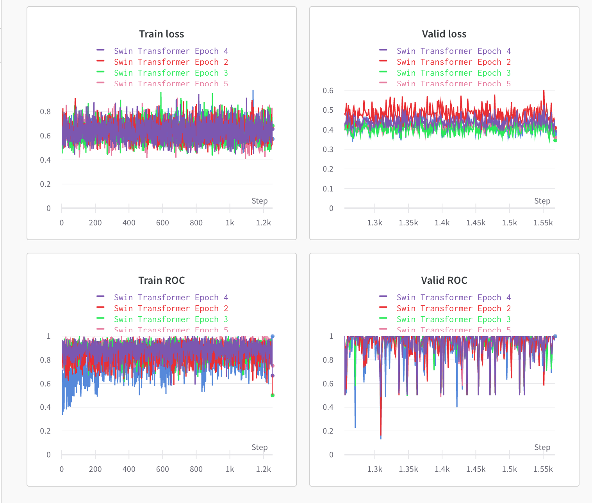

<h1 align='center'>SETI Breakthrough Listen - E.T. Signal Search</h1>

<p align="center">

</p>

<p align="center">


</p>

## Introduction
In this competition hosted on Kaggle, we use our data science skills to help identify anomalous signals in scans of Breakthrough Listen targets. Because there are no confirmed examples of alien signals to use to train machine learning algorithms, the team included some simulated signals (that they call “needles”) in the haystack of data from the telescope. They have identified some of the hidden needles so that you can train your model to find more. The data consist of two-dimensional arrays, so there may be approaches from computer vision that are promising, as well as digital signal processing, anomaly detection, and more. 

This is an Image Classification Competetion.

📍 Find my Gold Medal 🥇 Kaggle Notebook [here](https://www.kaggle.com/ligtfeather/swinformer-cutmix-amp-accelerate-w-b).

## Data

In this competition you are tasked with looking for technosignature signals in cadence snippets taken from the Green Bank Telescope (GBT). Please read the extended description on the Data Information tab for detailed information about the data (that's too lengthy to include here).

	• train/ - a training set of cadence snippet files stored in numpy float16 format (v1.20.1), one file per cadence snippet id, with corresponding labels found in the train_labels.csv file. Each file has dimension (6, 273, 256), with the 1st dimension representing the 6 positions of the cadence, and the 2nd and 3rd dimensions representing the 2D spectrogram.

	• test/ - the test set cadence snippet files; you must predict whether or not the cadence contains a "needle", which is the target for this competition

	• sample_submission.csv - a sample submission file in the correct format

	• train_labels - targets corresponding (by id) to the cadence snippet files found in the train/ folder

	• Submissions are evaluated on area under the ROC curve between the predicted probability and the observed target.

## Approach

I have implemented a transfer learning approach using a [Swin Transformer](https://arxiv.org/abs/2103.14030).


Other techniques implemented are:

• CUTMIX - CutMix is an image data augmentation strategy. Instead of simply removing pixels as in Cutout, we replace the removed regions with a patch from another image. The ground truth labels are also mixed proportionally to the number of pixels of combined images. The added patches further enhance localization ability by requiring the model to identify the object from a partial view.  


• AMP - AMP provides convenience methods for mixed precision, where some operations use the torch.float32 (float) datatype and other operations use torch.float16 (half).

• AUTOCASTING - Instances of autocast serve as context managers or decorators that allow regions of your script to run in mixed precision. autocast should wrap only the forward pass(es) of your network, including the loss computation(s). Backward passes under autocast are not recommended.

• GRADIENT SCALING - If the forward pass for a particular op has float16 inputs, the backward pass for that op will produce float16 gradients. Gradient values with small magnitudes may not be representable in float16. These values will flush to zero (“underflow”), so the update for the corresponding parameters will be lost. To prevent underflow, “gradient scaling” multiplies the network’s loss(es) by a scale factor and invokes a backward pass on the scaled loss(es). Gradients flowing backward through the network are then scaled by the same factor. In other words, gradient values have a larger magnitude, so they don’t flush to zero.

• WEIGHTED RANDOM SAMPLER - Samples elements from [0 ,.., len(weights)-1] with given probabilities (weights).

• TEST TIME AUGMENTATION - Similar to what Data Augmentation is doing to the training set, the purpose of Test Time Augmentation is to perform random modifications to the test images. Thus, instead of showing the regular, “clean” images, only once to the trained model, we will show it the augmented images several times. We will then average the predictions of each corresponding image and take that as our final guess.
The reason why it works is that, by averaging our predictions, on randomly modified images, we are also averaging the errors. The error can be big in a single vector, leading to a wrong answer, but when averaged, only the correct answer stand out.  


• ACCELERATE BY HUGGINGFACE 🤗 - Accelerate provides an easy API to make your scripts run with mixed precision and on any kind of distributed setting (multi-GPUs, TPUs etc.) while still letting you write your own training loop. The same code can then runs seamlessly on your local machine for debugging or your training environment.
In 5 Lines of code we can run our scripts on any distributed setting!

• WEIGHTS AND BIASES - Wandb is a developer tool for companies turn deep learning research projects into deployed software by helping teams track their models, visualize model performance and easily automate training and improving models.
We will use their tools to log hyperparameters and output metrics from your runs, then visualize and compare results and quickly share findings with your colleagues.

## Training the Model

Steps to train and validate the model are as follows:

### 1. Download the data from Kaggle

Start by downloading the data from [here](https://www.kaggle.com/c/seti-breakthrough-listen/data). 

Then unzip the file and extract it into a new folder: `input/`.


### 2. Installing the dependencies

I have utilized plenty of libraries here which can easily been installed using the following command.

```shell
$ pip install -r requirements.txt
```

### 3. Training the Model

Finally run the `main.py` file and the training and validation should begin.

```shell
$ python main.py
```

This should start training in a few seconds and you will see a wandb bar which will track our metrics live during training and validation.

### 3. Evaluating the Model

Evaluate on the test by running the `evaluate.py` file.

```shell
$ python evaluate.py
```

This should start training in a few seconds and you will see a wandb bar which will track our metrics live during training and validation.


## Validation Results

We can see our model performance on Weights and biases for Swin Transformer for 5 epochs.



## Evaluation and Submission

To test the model performance on the test set, run the `evaluate.py` file which will also save a `submission.csv` file which can be used to submit to the competetion.

**Please Star ⭐ this repository if you find it insightful!!**